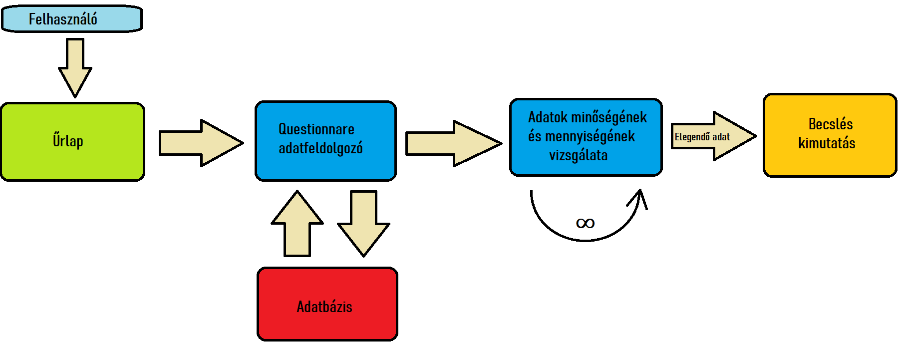
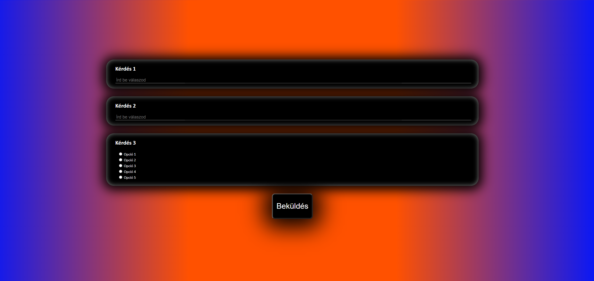
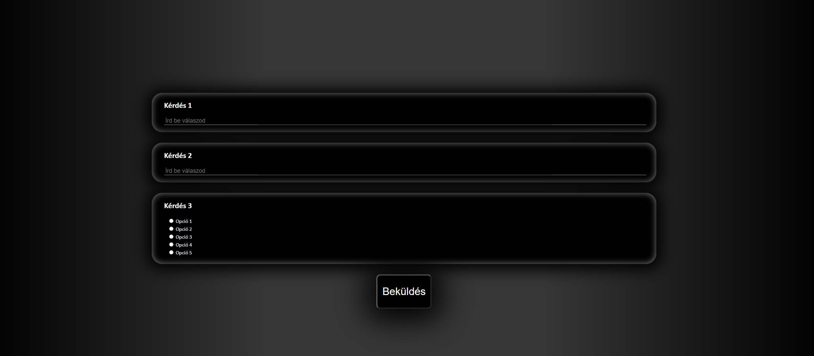

<h1>Funckionális specifikáció</h1> 

<h2><strong>Jelenlegi helyzet leírása</strong></h2>

Jelenleg a megrendelő egy <strong>papíralapú</strong> kérdőív rendszert alkamaz. Ennek <strong>hosszadalmas a kiértékelése,  
rendezetten tartása</strong>. A jelenlegi rendszeren belül is <strong>léteznek előzetes tudást felmérő kérdések</strong>, 
 
melyeket a megrendelő szeretné ,ha implementálnánk a készülő rendszerbe is. A jelenlegi kérdőív kitöltése   
egy <strong>10-20 percet</strong> vesz igénybe, a kérdőíveket tollal töltik ki, így ha valamely résztvevő megváltoztatja
 
a véleményét, kisatírozott válaszok jönnek létre, így <strong>jelenleg semmilyen módon sem lehetséges a gépi
 
kiértekelés</strong>. Mivel a rendszer papíralapú és a kiértékelése sem gépi, így a kapott válaszoka/jóslatokat 
 
kézzel vezetik egy papíralapú füzetbe. Illetve a kiérteklést is kézzel számolják. 
 
A jelenlegi rendszer funkcionalitás szempontjából elavult, nem fenntartható az effajta működés
 
a jövőre nézve. 
<strong>Ennek a rendszernek és kiértékelésnek szeretné a megrendelő az egyszerűsítését és automatizálását.</strong>

<h2>Vágyálom rendszer leírása:</h2>
Egy olyan rendszer szükséges számunkra amely kérdőív kitöltése kapcsán adatok feldolgozását teszi lehetővé.
Funkcionalitást tekintve a rendszer egy kerdőívből álljon, tehát a felhasználó egy barátságos és egyértelmű
felületet kell, hogy kapjon amin elsősorban fel kell, hogy mérjük tudását és a kérdőív másik felében megfelelő
súlyozással tudjuk a válaszát feldolgozni. Amint ecseteltem, a kérdőív első része egy felmérés arról, hogy az
illetőnek a témával kapcsolatban mennyi tudása van. A második felében pedig egyszerű kérdésekre vár választ a rendszer
annak függvényében, hogy a feldolgozott adatból később egy jövőbeli becslést hajtsunk végre automatizáltan.

<h2>A rendszerre vonatkozó szabályok leírása</h2> 

- A rendszer a megadott adatokat adatbázisban tárolja
- Átlátható kód
- Legnépszerűbb böngészők támogatása (Chrome, Firefox, Edge, Opera, Safari)
- Mobil böngészőn megfelelő megjelenítés
- Igényes kinézet, egyszerű kezelhetőség
- Reszponzivitás, azaz különböző méretű eszközönként megfelelő megjelenés

<h2>Igényelt üzleti folyamatok modellje</h2>
Az üzleti folyamat modelljében látható, hogyan valósul meg az adatnak a feldolgozása a felhasználótól az automatizációs rendszeren keresztül.

A modell kimutatja, hogy az adatbevitel űrlapon keresztül történik.
Az adat az üzleti logika kapcsán feldolgozásra kerül adatbázis segítségével, továbbá elegendő adat mennyiség és minőség után egy becslést határoz meg a rendszer.

<h2>Képernyőterv<h2>

Light Mode:

Dark Mode:

<h2>Fogalomszótár</h2> 

- Felmérés - több felhasználó által megadott adat (kérdésekre válaszok) összesítése, összevetése.

- Questionarre - Kérdőív, mely a felmérést megvalósítja, több kérdés feltétele során.

- Reszponzivitás - Optimális megjelenítés a lehető legtöbb eszközön.

- Adat - Olyan ismert vagy megfigyelt tény melyek számmal leirhatók, és számítástechnikai eszközökkel feldolgozhatóak, megjeleníthetők.

- Adatfeldolgozás - Az a folyamat mely során az adat feldolgozásra kerül.

- Automatizált - Egy olyan folyamat, mely emberi beavatkozást nem (vagy kevésbé) igényel.

- Felhasználói felület - A rendszer azon elemei, mely közvetlenül a felhasználóval lépnek interakcióba, és barátságos megjelenéssel rendelkeznek.

- Becslés - Egy téma kapcsán egy esemény vagy érték hozzávetőleges meghatározása.

<h2>Forgatókönyvek</h2> 

A felhasználó megkezdi a kérdőívet valamilyen böngésző segítségével.  
A kitöltés során különböző kérdéseket kap, melyeket megválaszol.  
Első körben elképzelhető egy felmérés, mely a felhasználó jártasságát célozza meg az adott témakörben.  
Ezután, legfőképp olyan kérdéseket fog kapni, melyeket egy 1-5-ig terjedő skálán meg tud válaszolni, vagy szám értéket ad meg, vagy olyan típusú kérdést kap, melyre érkezett válasz átalakítható szám értékké.  

<h2><strong>Követelménylista</strong></h2>

|Modul| ID | Név |V.| Kifejtés|
|---|---|---|---|---|
|-| K01| Adatbázisban tárol|-|A rendszer a kapott válaszokat egy adatbázisban eltárolja.|
|-| K02| Szám értéket vár válaszként|-|A kérdésekre válaszként <strong>CSAK</strong> szám értéket fogad el.|
|-| K03| Mérhető, gépi módon feldolgozható statisztika|-|Az adatbázisban való tárolás olyan formában történik melyből egyszerűen, <strong>GÉPI</strong> módon készíthetőek statisztikák, kimutatások.|
|-| K04| Egyszerűen kezelhető rendszer|-|A kérdőív egyszerűen kezelhető az end-user számára.|
|-| K05| Felméri a válaszadó jártasságát a témában|-|Hasonlóan a jelenlegi papír alapú rendszerhez, szeretnénk implementálni olyan kérdéseket a predikció előtt ami felméri ,hogy a válaszadó tulajdonképpen mennyire jártas-e a témában. Ezzel szeretnénk kiszűrni a szimpla tippeket a valóságos spekulációk közül.|
|-| K06| Rövid maximum két, három soros kérdések|-|A figyelem fenntartása érdekében maximum két, három soros kérdések szerepelhet a kérdőívben.|
|-| K07| Webes reszponzív dizájn|-|Hogy továbbra is a populáció nagy százalékának lehetősége legyen kitölteni a kérdőívet, hasonlóan a jelenlegi papíralapú rendszerhez, ezért a weboldal dizájnjának reszponzívnak kell lennie és megfelelően megjelennie és használhatóank lennei a jelenleg használt legtöbb eszközön(számítógépek, telefonok, tableket) illetve modellen.|
|-| K07| A rendszer egy kérdőívból álljon|-|A rendszer célja továbbra is egyértelműen az adatgyűjtés legyen, ezért egy egyszerűen kezelhető barátságos kérdőívből kell állnia.|
|-| K08| Megfelelő súlyozás|-|A kapot válaszokat megfelelő súlyozással kell feldolgoznunk, mely függ a válaszadó előzetes tudásától, hogy megfelelő és valós statisztikát kaphassunk.|
