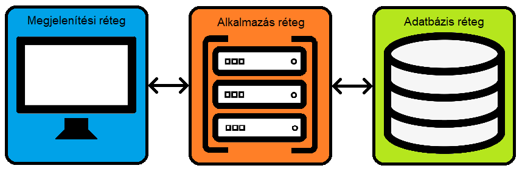

<h2>Projekt terv:</h2>

<h3>Projektszerepkörök, felelősségek:</h3>
<h4>Scrum Master:</h4>

Felügyeli a folyamat fenntartását, segíti a csapatot probléma esetén. Kezeli a projekt main ágát. 
Felügyeli, hogy a csapattagok betartják-e a Scrum szabályokat, tartják-e a sprint határidejét.

<h4>Csapat:</h4>

Felelősek azért, hogy az aktuális sprintre bevállalt feladatokat elvégezzék.

<h3>Projektmunkások és szerepköreik:</h3>

Papp Csenge: Scrum Master, Csapat 
Zselenák Flórián: Csapat 
Hosszú Szilárd: Csapat 
Semendi Ádám: Csapat 
Szatmári Boldizsár: Csapat

<h3>Ütemterv:</h3>

A sprintek megkezdése előtti két hétben el kell készülnie a projekt dokumentumainak. A projekt kivitelezésére 5 egyhetes sprint áll rendelkezésre. Az első 2 sprint alatt el kell készülnie egy projektet bemutató demónak, melyet a megrendelő értékelhet a kész projekt átvétele előtt.

<h3>Mérföldkövek:</h3>

1. Funkciók meghatározása 
2. UI megtervezése 
3. Funkciók kivitelezése 
4. UI kivitelezése 
5. Funkciók integrálása 
6. UI, Funkciók tesztelése

<h2>Architekturális terv:</h2>

A projekt során egy 3-rétegű Ionic framework segítségével megírt PHP webapplikáció fog megszületni. 
Az applikáció adatbázisa MySQL alapú. 
A rendszer könnyen bõvíthetõ extra funkciókkal. 
Biztonsági funkciókra nincs szükség.

<h2>Fizikai környezet</h2>
<ul>
<li> Az kérdőív a könnyű hozzáférhetőség és gyors működés érdekében a legtöbb modern böngészőben működni fog, így a legtöbb grafikus felülettel rendelkező operációs rendszer alatti működés alapvető.</li>
<ul>
    <li>Windows környezet alatt</li>
    <li>Linux környezet alatt</li>
    <li>macOS környezet alatt</li>
    <li>Android környezet alatt</li>
    <li>iOS környezet alatt</li>
    </ul>
<li>Ajánlott böngészők:</li>
    <ul>
    <li>Google Chrome</li> 
    <li>Mozilla Firefox</li>
    <li>Microsoft Edge</li>
    <li>Safari</li>
    <li>Opera</li>
    </ul>
<li>Ajánlott Architektúrák:</li>
    <ul>
    <li>ARM</li> 
    <li>ARM64</li>
    <li>x64</li>
    <li>x86</li>
    </ul>
<li> Csak saját komponenseket használunk fel</li>
<li>Fejlesztői eszközök:</li>
<ul>
    <li>Visual Studio</li>
    <li>Intellij</li>
    <li>Github</li>
    <li>Trello</li>
    </ul>
</ul>