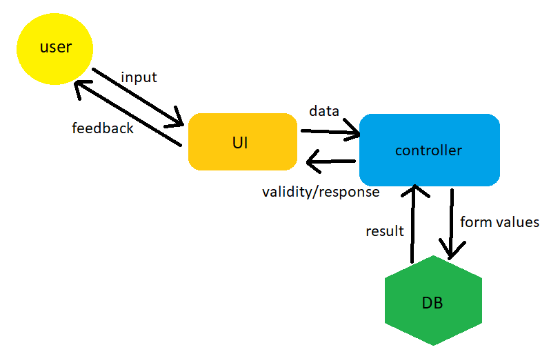

<h1>Rendszerterv</h1>
<h2>Telepítési terv</h2>
Az alkalmazásunkat a felhasználók egy webes felületen érhetik majd el. 
A felhasználóknak nem szükséges semmi mást feltelepíteni egy használni kívánt böngészőn kívül. 
Ez a böngésző lehet: 
-Google Chrome 
-Opera 
-Safari 
-Firefox 
-Microsoft Edge 
 
<h2>A rendszer célja</h2>

<strong>Az általunk létrehozni kívánt rendszer célja, hogy az Önök elvárásait elégítse ki a lehető legnagyobb mértékben. Ennek a rendszernek a céljai a következők:
   </strong>
  <ul>
   <li>Karbantarhatóság és adatok egyszerű feldolgozásának biztosítása.</li>
   <li>Helyes, pontos működés biztosítása.</li>
   <li>Megjelenése minden eszközön használható és reszponzív.</li>
   <li>Az utómunka (ez esetben a válaszok rögzítése, feldolgozása) meggyorsítása, egyszerűvé, automatizáltáttá tétele.</li>
   <li>Egy olyan felület biztosítása melyen található, Világos illetve Sötét mód, mely nagyítása lehetséges, biztosítva a felhasználók számára a kellemes és egyszerű kitöltést.</li>
   <li>A jelenlegi papír alapú rendszer teljes felváltása.</li>
</ul>

<h2>Projekt terv:</h2>

<h3>Projektszerepkörök, felelősségek:</h3>
<h4>Scrum Master:</h4>

Felügyeli a folyamat fenntartását, segíti a csapatot probléma esetén. Kezeli a projekt main ágát. 
Felügyeli, hogy a csapattagok betartják-e a Scrum szabályokat, tartják-e a sprint határidejét.

<h4>Csapat:</h4>

Felelősek azért, hogy az aktuális sprintre bevállalt feladatokat elvégezzék.

<h3>Projektmunkások és szerepköreik:</h3>

Papp Csenge: Scrum Master, Csapat 
Zselenák Flórián: Csapat 
Hosszú Szilárd: Csapat 
Semendi Ádám: Csapat 
Szatmári Boldizsár: Csapat

<h3>Ütemterv:</h3>

A sprintek megkezdése előtti két hétben el kell készülnie a projekt dokumentumainak. A projekt kivitelezésére 5 egyhetes sprint áll rendelkezésre. Az első 2 sprint alatt el kell készülnie egy projektet bemutató demónak, melyet a megrendelő értékelhet a kész projekt átvétele előtt.

<h3>Mérföldkövek:</h3>

1. Funkciók meghatározása 
2. UI megtervezése 
3. Funkciók kivitelezése 
4. UI kivitelezése 
5. Funkciók integrálása 
6. UI, Funkciók tesztelése

<h2>Architekturális terv:</h2>

A projekt során egy 3-rétegű Ionic framework segítségével megírt PHP webapplikáció fog megszületni. 
Az applikáció adatbázisa MySQL alapú. 
A rendszer könnyen bõvíthetõ extra funkciókkal. 
Biztonsági funkciókra nincs szükség.

<h2>Fizikai környezet</h2>
<ul>
<li> Az kérdőív a könnyű hozzáférhetőség és gyors működés érdekében a legtöbb modern böngészőben működni fog, így a legtöbb grafikus felülettel rendelkező operációs rendszer alatti működés alapvető.</li>
<ul>
    <li>Windows környezet alatt</li>
    <li>Linux környezet alatt</li>
    <li>macOS környezet alatt</li>
    <li>Android környezet alatt</li>
    <li>iOS környezet alatt</li>
    </ul>
<li>Ajánlott böngészők:</li>
    <ul>
    <li>Google Chrome</li> 
    <li>Mozilla Firefox</li>
    <li>Microsoft Edge</li>
    <li>Safari</li>
    <li>Opera</li>
    </ul>
<li>Ajánlott Architektúrák:</li>
    <ul>
    <li>ARM</li> 
    <li>ARM64</li>
    <li>x64</li>
    <li>x86</li>
    </ul>
<li> Csak saját komponenseket használunk fel</li>
<li>Fejlesztői eszközök:</li>
<ul>
    <li>Visual Studio</li>
    <li>Intellij</li>
    <li>Github</li>
    <li>Trello</li>
    </ul>
</ul>
<h2>Funkcionális terv</h2>

	Az önök elképzelései alapján a szoftver reszponzív dizájnt fog kapni. A válaszok
	rövid és tömör megfogalmazást kapnak. A felhasználóknak számmal kellesz válaszolniuk a különböző
	kérdésekre. A kérdőív első felében súly lesz számolva az alapján, hogy a kitöltő mennyire jártas az adott témában.
	A második fele fogja a becslést segíteni a súly alapján. A dizájn sötét móddal is el lesz látva azok számára
	akik jobban preferálják. Miután a kérdőív kitöltésre került, a kérdőív ID-je, témaismeretség súlya valamint a válaszokra adott
	értékek egy központi adatbázisba tárolásra kerülnek.
	Ha a kérdőív elegendő választ gyűjt össze, létrejön a becslés számítása ami kérésre a kitöltők e-mail címére kiküldésre kerül.
	A termék a támadók ellen is védve kell, hogy legyen, így az XSS ellen a bemenet vágva lesz, valamint a lehetséges SQL Injection elkerülése érdekében
	erre is fel lesz készítve a termék így kellő biztonságot fog önöknek nyújtani. Mivel cégünk backend fejlesztői keretrendszer nélkül dolgoznak
	ezért ezeket a lépéseket manuálisan saját algoritmussal fogják megoldani.
	A megvalósításhoz rétegelt architektúra fog struktúrában létrejönni, hogy minden funkció a maga feladatát lássa el.
	A biztonság érdekében különböző tesztesetek lesznek végrehajtva, hogy megyőzzük önöket a termék biztonsága érdekében a natív PHP backend miatt.

<h2>Adatbázis terv</h2>

Mivel az adatok egy központi adatbázisba lesznek tárolva ezért elengedhetetlen a megfelelő adatkezelés.
A szoftver két adatbázistáblát fog tartalmazni ami a következőképpen fog kinézni: 
"kerdoivek" tábla:  
<ul>
<li>1.oszlop: id </li>
<li>2.oszlop: súly </li>
<li>4.oszlop: első érték </li>
<li>5.oszlop: második érték </li>
<li>6.oszlop: harmadik érték </li>
<li>7.oszlop: negyedik érték </li>
<li>8.oszlop: ötödik érték </li>
<li>9.oszlop: dátum </li>
</ul>
Az első oszlop a beküldött kérdőív azonosítóját tartalmazza ami autoincrement tulajdonsággal rendelkezik és generált.
A súly a PHP backend részlegén kerül kiszámításra a kérdőív első feléből amihez a "helyes_adatok" tábla ad irányt.
A következő oszlopok az egyes eredményekre adott választ fogják külön tárolni, majd az utolsó oszlop a beküldés dátumát
statisztika számolásához egy opcionális paraméter. 
"helyes_adatok" tábla: </li>
<li>1.oszlop: első érték </li>
<li>2.oszlop: második érték </li>
<li>3.oszlop: harmadik érték </li>
<li>4.oszlop: negyedik érték </li>
<li>5.oszlop: ötödik érték </li>
A tábla a súly kiszámításához ad segítséget amiből ki lehet számolni a beküldő jártasságát a témában.
A táblák között nem szerepel kapcsolat se függőség.

<h2>Üzleti folyamatok</h2>
Az üzleti folyamatok az alábbiak alapján fog létrejönni: 

Ahogy a képen is látható, a felhasználó közvetlen a kérdőívet éri el. Miután a kérdőív kitöltésre került
Az adatt továbítódik a feldolgozószkriptnek ami a bemenetet támadási értékek esetén semlegesíti. Miután
megtörtént az adatok előkészítése továbítja az adatbázissal kapcsolatban lévő interfésznek. Ez az interfész 
biztonságos kapcsolódást nyújt az adatbázishoz, a bemenet itt is előkészített formában kerül továbításra az esetleg XSS védelmi hiba miatt az SQL injection kikerülése érdekében.
Ha a kapcsolat létrejött és sikeresen megtörtént az adatbázisba írás továbbítja az adatfeldolgozó interfésznek a választ és a felhasználó informatív
üzenetben részesül annak kapcsán, hogy az adata feldolgozásra került-e.
Az adatfeldolgozó interfészben lévő ellenőrző szkript meghívásra került ha elegendő adat került az adatábizsba
és becslő interfész dolgozni kezd, majd elkészíti a becslést és ha a felhasználó kérte akkor e-mailben választ kap. Egyéb esetben egy fájlba íródik
a létrejött becslést. Továbbá a program log rendszerrel lesz ellátva, hogy az egyes események megfelelően követhetőek legyenek.

<h2>Tesztterv</h2>

<h3>Tesztelés elvei:</h3>

   <ul>
  <li>Tesztelés során szeretnénk meggyőződni arról, hogy az elkészült kérdőív megfelelően fogadja, feldolgozzza és tárolja a kapott válaszokat. </li>
  <li>Szeretnénk meggyőződni arról ,hogy minden alap, mindennapi használatban lévő gyakori eszközözön(telefon, laptop, számítógép) modellen, operációs rendszeren, böngészőben megfelelően funkcionál, reszponzív és felhasználóbarát az elkészült kérdőív. </li>
  <li>Fontos, hogy az elkészült projekt teljesítse a reszponzivitás elveit és egyszerűen használható legyen, ezzel garantálva azt ,hogy a kérdőívet továbbra is a népesség széles köre kitöltheti, így különböző rétegekből nyerhetünk adatokat. </li>
</ul>      

<h3>Tesztelés folyamat</h3>

<strong>- Manuális tesztelés</strong>

<ul>
   <li>Tesztelés különböző böngészőkben.</li>
   <li>Tesztelés különböző eszközökön.</li>
   <li>Tesztelés különböző operációs rendszereken.</li>
</ul>

<strong>- Unit tesztelés</strong>

<strong>- Penetration teszt</strong>

<h3>Tesztelés kontrollja</h3>

A kérdőív akkor megy át a tesztelés teljes fázisán, ha:
  <ul>
   <li>Átmegy a Unit teszteken</li>
     <li> Átmegy a Penetration teszten</li>
   <li>Megjelenése minden eszközön használható és reszponzív.</li>
    <li>A válaszok eltárolása minden eszközön <strong>HELYESEN</strong> megtörténik.</li>
</ul>

<h3>Tesztesetek</h3>

Manuális tesztelés esetén:
  <ul>
   <li>Tesztelés Windows operációs rendszeren, Opera böngészőben.</li>
   <li>Tesztelés Windows operációs rendszeren, Firefox böngészőben.</li>
   <li>Tesztelés Windows operációs rendszeren, Chrome böngészőben.</li>
   <li>Tesztelés Linux operációs rendszeren, Opera böngészőben.</li>
   <li>Tesztelés Linux operációs rendszeren, Firefox böngészőben.</li>
   <li>Tesztelés Linux operációs rendszeren, Chrome böngészőben.</li>
   <li>Tesztelés macOS operációs rendszeren, Opera böngészőben.</li>
   <li>Tesztelés macOS operációs rendszeren, Firefox böngészőben.</li>
   <li>Tesztelés macOS operációs rendszeren, Chrome böngészőben.</li>
   <li>IOS alapú telefonon.</li>
   <li>Android alapú telefonon.</li>
   <li>IOS alapú tableten.</li>
   <li>Windows alapú tableten.</li>
</ul>

<h3>Sikeres teszt kritériumai:</h3>

- A kérdőív reszponzív, felhasználóbarát az összes tesztelt eszközön, megfelelően dolgozza fel és tárolja az adatokat minden esetben. Illetve átmegy a Unit teszteken.

<h3>Karbantartási terv</h3>

   <ul>
   <li>A dependenciák időszakos ellenőrzése, hogy megakadályozzuk az adat kiszivárgást és biztosítsuk a rendszer biztonságosságát. </li>
   <li>Az adatbázisban tárolt adatok meglétének időszakos ellenőrzése, elkerülve azt az eshetőséget ,hogy régebbi adatok eltűnjenek esetlegesen erőforrás hiánya miatt. </li>
   <li>Reszponzivitás időszakos ellenőrzése Major Software Update esetén. </li>
   <li>Meglévő technológiák újabbakra cserélése igény és szükség esetén. </li>
   <li>Kérdések időszakos cseréje/bővítése, újabb témában való válaszgyűjtés igényének esetén. </li>
   </ul>

<h2>Telepítési terv</h2>
Az alkalmazásunkat a felhasználók egy webes felületen érhetik majd el. 
A felhasználóknak nem szükséges semmi mást feltelepíteni egy használni kívánt böngészőn kívül. 
Ez a böngésző lehet: 
-Google Chrome 
-Opera 
-Safari 
-Firefox 
-Microsoft Edge 
 

<h2>Implementációs terv</h2>

A weboldal alapjaa html és css lesz, működéséért egy php kód fog felelni. 
A kinyert adatokat egy MySQL alapú adatbázisban tároljuk. 
A felhasználó az oldalra érkezésekor kiválaszthatja, hogy melyik kérdőívet szeretné kitölteni. 
Ennek kiválasztása után a kérdőív előtti teszthez kerül, aminek helyes kitöltése után léphet tovább a valódi kérdőívhez. 
Azt, hogy a teszten elegendő pontszámot ért e el a kitöltő, egy php kóddal ellenőrizzük le. 
Php kód lesz azért is a felelős, hogy a kérdőív kitöltése közben a kitöltő ne tudjon rossz választ adni (számok helyett betűk, stb.). 
A kitöltés elvégzése után az adatbázisba továbbitjuk a kinyert információkat. 
Amikor szükségünk lesz egy statisztikára, az adatbázisból hivjuk meg az adatokat, és egy algoritmussal elvégeztetjük a statisztikák elkészítését. 

A statisztikákat megjelenitjük az oldalon és lehetőséget kinálunk ezek kimentésére.  
<h3>A rendszer követelményei</h3>

A statisztikákat megjelenitjük az oldalon és lehetőséget kinálunk ezek kimentésére.  

A statisztikákat megjelenitjük az oldalon és lehetőséget kinálunk ezek kimentésére.  

<h3>Absztrakt domain modell</h3>

Alkalmazásunk olyan részekből fog állni, melyek PHP, HTML és CSS részeket foglalnak magukba.
Megvalósításra egy olyan rétegelt felépítésre gondoltunk, mely a következőket valósítja meg:
<ul>
   <li>Frontend felület, melyet a felhasználó lát és ezzel interakcionál</li>
   <li>Backend felület, mely az adatbázissal való kapcsolatot biztosítja </li>
</ul>
Alkalmazásunk a felhasználó által megadott válaszokat egy form-on keresztül fogja megtenni.
Ennek validálásáért egy olyan komponens fog felelni, mely figyeli a beírt adat helyességét és validitását.

<h2>A rendszer követelményei</h2>

A rendszer követelményei javarészt az olyan követelményeket foglal magába, melyek megvalósítását megcélozza a rendszerterv.
Ezek a következők:

|Modul| ID | Név |V.| Kifejtés|
|---|---|---|---|---|
|-| K01| Adatbázisban tárolás|-|A rendszer a kapott válaszokat egy adatbázisban eltárolja.|
|-| K02| Szám érték elvárása válaszként|-|A kérdésekre válaszként <strong>CSAK</strong> szám értéket fogad el.|
|-| K03| Tizedes számok helyes bevitele|-|A rendszer a kérdésre adott esetleges tizedes számot helyesen kezeli (pont-vessző probléma).|
|-| K04| Mérhető, gépi módon feldolgozható statisztika|-|Az adatbázisban való tárolás olyan formában történik melyből egyszerűen, <strong>GÉPI</strong> módon készíthetőek statisztikák, kimutatások.|
|-| K05| Egyszerűen kezelhető rendszer|-|A kérdőív egyszerűen kezelhető az end-user számára.|
|-| K06| Felhasználó jártasságának felmérése a témában|-|Hasonlóan a jelenlegi papír alapú rendszerhez, szeretnénk implementálni olyan kérdéseket a predikció előtt ami felméri ,hogy a válaszadó tulajdonképpen mennyire jártas-e a témában. Ezzel szeretnénk kiszűrni a szimpla tippeket a valóságos spekulációk közül.|
|-| K07| Rövid kérdések|-|A figyelem fenntartása érdekében maximum két, három soros kérdések szerepelhet a kérdőívben.|
|-| K08| Webes reszponzív dizájn megléte|-|Hogy továbbra is a populáció nagy százalékának lehetősége legyen kitölteni a kérdőívet, hasonlóan a jelenlegi papíralapú rendszerhez, ezért a weboldal dizájnjának reszponzívnak kell lennie és megfelelően megjelennie és használhatónak lennie a jelenleg használt legtöbb eszközön(számítógépek, telefonok, tabletek) illetve modellen.|
|-| K09| A rendszer egy kérdőívből álljon|-|A rendszer célja továbbra is egyértelműen az adatgyűjtés legyen, ezért egy egyszerűen kezelhető barátságos kérdőívből kell állnia.|
|-| K10| Megfelelő súlyozás|-|A kapott válaszokat megfelelő súlyozással kell feldolgoznunk, mely függ a válaszadó előzetes tudásától, hogy megfelelő és valós statisztikát kaphassunk.|
