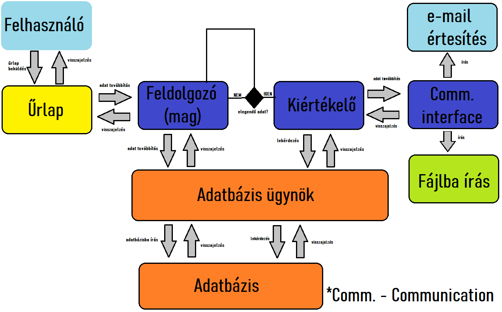

<h2>Funkcionális terv</h2>

	Az önök elképzelései alapján a szoftver reszponzív dizájnt fog kapni. A válaszok
	rövid és tömör megfogalmazást kapnak. A felhasználóknak számmal kellesz válaszolniuk a különböző
	kérdésekre. A kérdőív első felében súly lesz számolva az alapján, hogy a kitöltő mennyire jártas az adott témában.
	A második fele fogja a becslést segíteni a súly alapján. A dizájn sötét móddal is el lesz látva azok számára
	akik jobban preferálják. Miután a kérdőív kitöltésre került, a kérdőív ID-je, témaismeretség súlya valamint a válaszokra adott
	értékek egy központi adatbázisba tárolásra kerülnek.
	Ha a kérdőív elegendő választ gyűjt össze, létrejön a becslés számítása ami kérésre a kitöltők e-mail címére kiküldésre kerül.
	A termék a támadók ellen is védve kell, hogy legyen, így az XSS ellen a bemenet vágva lesz, valamint a lehetséges SQL Injection elkerülése érdekében
	erre is fel lesz készítve a termék így kellő biztonságot fog önöknek nyújtani. Mivel cégünk backend fejlesztői keretrendszer nélkül dolgoznak
	ezért ezeket a lépéseket manuálisan saját algoritmussal fogják megoldani.
	A megvalósításhoz rétegelt architektúra fog struktúrában létrejönni, hogy minden funkció a maga feladatát lássa el.
	A biztonság érdekében különböző tesztesetek lesznek végrehajtva, hogy megyőzzük önöket a termék biztonsága érdekében a natív PHP backend miatt.

<h2>Adatbázis terv</h2>

Mivel az adatok egy központi adatbázisba lesznek tárolva ezért elengedhetetlen a megfelelő adatkezelés.
A szoftver két adatbázistáblát fog tartalmazni ami a következőképpen fog kinézni: 
"kerdoivek" tábla:  
<ul>
<li>1.oszlop: id </li>
<li>2.oszlop: súly </li>
<li>4.oszlop: első érték </li>
<li>5.oszlop: második érték </li>
<li>6.oszlop: harmadik érték </li>
<li>7.oszlop: negyedik érték </li>
<li>8.oszlop: ötödik érték </li>
<li>9.oszlop: dátum </li>
</ul>
Az első oszlop a beküldött kérdőív azonosítóját tartalmazza ami autoincrement tulajdonsággal rendelkezik és generált.
A súly a PHP backend részlegén kerül kiszámításra a kérdőív első feléből amihez a "helyes_adatok" tábla ad irányt.
A következő oszlopok az egyes eredményekre adott választ fogják külön tárolni, majd az utolsó oszlop a beküldés dátumát
statisztika számolásához egy opcionális paraméter. 
"helyes_adatok" tábla:  
1.oszlop: első érték  
2.oszlop: második érték  
3.oszlop: harmadik érték  
4.oszlop: negyedik érték  
5.oszlop: ötödik érték  
A tábla a súly kiszámításához ad segítséget amiből ki lehet számolni a beküldő jártasságát a témában.
A táblák között nem szerepel kapcsolat se függőség.

<h2>Üzleti folyamatok</h2>
Az üzleti folyamatok az alábbiak alapján fog létrejönni: 

Ahogy a képen is látható, a felhasználó közvetlen a kérdőívet éri el. Miután a kérdőív kitöltésre került
Az adatt továbítódik a feldolgozószkriptnek ami a bemenetet támadási értékek esetén semlegesíti. Miután
megtörtént az adatok előkészítése továbítja az adatbázissal kapcsolatban lévő interfésznek. Ez az interfész 
biztonságos kapcsolódást nyújt az adatbázishoz, a bemenet itt is előkészített formában kerül továbításra az esetleg XSS védelmi hiba miatt az SQL injection kikerülése érdekében.
Ha a kapcsolat létrejött és sikeresen megtörtént az adatbázisba írás továbbítja az adatfeldolgozó interfésznek a választ és a felhasználó informatív
üzenetben részesül annak kapcsán, hogy az adata feldolgozásra került-e.
Az adatfeldolgozó interfészben lévő ellenőrző szkript meghívásra került ha elegendő adat került az adatábizsba
és becslő interfész dolgozni kezd, majd elkészíti a becslést és ha a felhasználó kérte akkor e-mailben választ kap. Egyéb esetben egy fájlba íródik
a létrejött becslést. Továbbá a program log rendszerrel lesz ellátva, hogy az egyes események megfelelően követhetőek legyenek.

