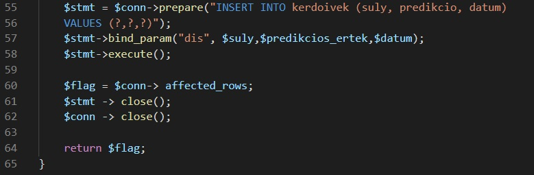

<h1> Tesztelési jegyzőkönyv </h1>

<h2> Penetration testing </h2>

<h3> Potenciális sérülékenységek </h3>

	Az alkalmazás potenciális sérülékenységei közé tartoznak azon elemek amelyek esedékesen sérülékenyek lehetnek, ide tartoznak a technológiák amivel az alkalmazás meg lett valósítva.
	Az alkalmazás használ adatbázist amely implementálásfüggően SQL Injection-t tartalmazhat. A kérdőív adatai
	JSON objektumként vannak továbbítva. Itt történhet JSON Deserilization sérülékenység illetve valamilyen XSS vektor továbbítása a backendre.
	 
	Tehát a megvizsgálandó sérülékenységek:
	<ul>
		<li>SQL Injection</li>
		<li>XSS</li>
		<li>JSON ellenőrzés bypass</li>
	</ul>

<h3> Tesztelés fázisa </h3>

<h4>SQL Injection</h4>

 Mivel a webalkalmazás forráskódját ismerjük ezért az SQL Injection részét tesztelés nélkül
is alátámasztani lehet, hogy biztonságos. A következő képen látható, hogy a tesztelés hatására
nem fog történni semmilyen adatbázist sértő művelet, mivel a backend a prepared statement használatával előkészíti
és biztonságos módon adja át a lekérdezésnek az adatokat: 

A tesztelés eredményeképpen alátámasztva bebizonyosodott, hogy az alkalmazás 
felkészült az SQL Injection támadás ellen.

<h4> XSS </h4>

Az alkalmazás XSS ellen olyan szinten véd, hogy a lehetséges input mezők mindenképp castolva vannak integer formátummá
így nem tud semmilyen XSS alapú vektor a szerverhez jutni. A megvalósítás a következő: 

A tesztelés folyamán az alkalmazásba nem jutott be semmilyen XSS alapú vekter.

<h4> JSON Bypass </h4>

A JSON bemenet parseolása kulcsok alapján történik, ez azt jelenti, hogy csak a megfelelő kulcsú JSON fájlok kerülnek
beolvasásra. Ezek kívül az értékek szintén integerre castolása miatt az alkalmazás nem sérülékeny a JSON alapú támadási vektorok ellen sem.

A tesztelés folyamán az említett állítások valóban bebizonyosodtak, így az alkalmazás védelme megfelelőnek bizonyosult.

<h3><b>Penetration testing:</b>
<i>
PASSED

</i>
</h3>

## **Manuális tesztelés:**

| Eszköz | Operációs rendszer | Böngésző | Helyes működés(Igen/Nem)|
|----------|-------------|------|----------|
| Iphone 8 Plus|   IOS 15.0.2 | Safari | Igen |
| PC |  Windows 10 Pro 20H2  19042.1348| Opera GX| Igen |
| PC |  Windows 10 Pro 20H2  19042.1348| Opera| Igen |
| PC |  Windows 10 Pro 20H2  19042.1348| Microsoft Edge| Igen |
| PC |  Windows 10 Pro 20H2  19042.1348| Firefox| Igen |
| PC |  Windows 10 Pro 20H2  19042.1348| Google Chrome| Igen |
| HP Elite x2|  Windows 10 Pro 20H2  19042.1348| Opera GX| Igen |
| HP Elite x2|  Windows 10 Pro 20H2  19042.1348| Opera| Igen |
| HP Elite x2|  Windows 10 Pro 20H2  19042.1348| Microsoft Edge| Igen |
| HP Elite x2|  Windows 10 Pro 20H2  19042.1348| Firefox| Igen |
| HP Elite x2|  Windows 10 Pro 20H2  19042.1348| Google Chrome| Igen |

### Infó az eszközökről:

#### PC:

-  *Eszköz neve*	DESKTOP-E1KR63V
- *Processzor*	Intel(R) Core(TM) i5-7500 CPU @ 3.40GHz   3.40 GHz
- *Memória mérete*	16,0 GB (15,9 GB használható)
- *Eszköz azonosítója*	6FF3B08B-6D45-48E8-B207-BDA9FDD64DC3
- *Termékazonosító*	00330-80000-00000-AA708
- *Rendszer típusa*	64 bites operációs rendszer, x64-alapú processzor
- *Toll és érintés*	Ez a képernyő sem tollal történő, sem érintéses bevitelt nem tesz lehetővé

#### HP Elite x2:

- *Eszköz neve*	DESKTOP-U6F96DG
- *Processzor*	Intel(R) Core(TM) m5-6Y57 CPU @ 1.10GHz   1.51 GHz
- *Memória mérete*	8,00 GB (7,88 GB használható)
- *Eszköz azonosítója*	D1DA4186-027D-43F0-A367-0A3FE91E4A71
- *Termékazonosító*	00330-50351-61565-AAOEM
- *Rendszer típusa*	64 bites operációs rendszer, x64-alapú processzor
- *Toll és érintés*	Tollas bevitel és 10 érintési pontos érintéses bevitel támogatása